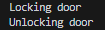

# Analyseverslag

Sten Hulsbergen

## Software

De code simuleert een scenario waarin verschillende sensoren en apparaten in een huis of gebouw met elkaar communiceren via het MQTT-protocol. Bijvoorbeeld, de temperatuursensor kan de huidige temperatuur publiceren naar het onderwerp "temperature", en de deurslot kan zich abonneren op het onderwerp "security" om te weten wanneer het moet vergrendelen of ontgrendelen. De code maakt ook gebruik van encryptie om de gegevens te beveiligen tegen wijzigingen die een hacker op het netwerk zou proberen te doen.

### Parent-classe - MQTT-onderdeel

```
class MQTT_item:
    sleutel_transpositie = 3
    sleutel_caesar = 9
    alfabet = "abcdefghijklmnopqrstuvw1234567890"

    def __init__(self, id, url, port):
        self.id = id
        self.client = mqtt.Client()
        self.client.connect(url, port)
        self.client.on_connect = self.__on_connect

    def __on_connect(self, client, userdata, flags, rc):
        print(f"{self.id}: connected with result code {rc}")

    def __encrypt_data(self, data):
        msg_len = float(len(data.lower()))
        msg_lst = list(data)

        row = int(math.ceil(msg_len / self.sleutel_transpositie))

        fill_null = int((row * self.sleutel_transpositie) - msg_len)
        msg_lst.extend('_' * fill_null)

        matrix = [msg_lst[i: i + self.sleutel_transpositie]
                  for i in range(0, len(msg_lst), self.sleutel_transpositie)]

        encrypted_data_transpositie = ''
        for _ in range(self.sleutel_transpositie):
            encrypted_data_transpositie += ''.join([row[_]
                                                    for row in matrix])

        encrypted_data_caesar = ""
        for let in encrypted_data_transpositie:
            encrypted_data_caesar += self.alfabet[(
                self.alfabet.find(let) + self.sleutel_caesar) % len(self.alfabet)]
        return encrypted_data_caesar

    def decrypt_data(self, encrypted_data):
        caesar_decrypted_data = ""
        for let in encrypted_data:
            caesar_decrypted_data += self.alfabet[(self.alfabet.find( let) - self.sleutel_caesar) % len(self.alfabet)]

        numOfColumns = math.ceil(len(caesar_decrypted_data) / self.sleutel_transpositie)
        numOfRows = self.sleutel_transpositie

        numOfShadedBoxes = (numOfColumns * numOfRows) - len(caesar_decrypted_data)
        plaintext = [''] * numOfColumns
        col = 0
        row = 0
        for symbol in caesar_decrypted_data:
            plaintext[col] += symbol
            col += 1
            if (col == numOfColumns) or (col == numOfColumns - 1 and row >= numOfRows - numOfShadedBoxes):
                col = 0
                row += 1
                
        return ''.join(plaintext).replace("_", "").replace("0", "")

    def publish_data(self, topic, data):
        self.client.loop_start()
        self.client.publish(f"data/{topic}", data, 1)
        self.client.loop_stop()

    def publish_data_encrypted(self, topic, data):
        self.client.loop_start()
        self.client.publish(f"data/{topic}/encrypted", self.__encrypt_data(str(data)), 1)
        self.client.loop_stop()
```

### Child-classe - temperatuursensor

```
class Temperature_sensor(MQTT_item):
    topic = "temperature"
    
    def __init__(self, id, url, port):
        super().__init__(id, url, port)

    def __get_temperature(self):
        return float(random.randrange(0, 301)) / 10

    def send_data(self):
        self.publish_data(self.topic, self.__get_temperature())

    def send_data_encrypted(self):
        self.publish_data_encrypted(self.topic, self.__get_temperature())
```

### Child-classe - vochtigheidsensor

```
class Humidity_sensor(MQTT_item):
    topic = "humidity"
    
    def __init__(self, id, url, port):
        super().__init__(id, url, port)

    def __get_humidity(self):
        return random.randrange(30, 101)

    def send_data(self):
        self.publish_data(self.topic, self.__get_humidity())

    def send_data_encrypted(self):
        self.publish_data_encrypted(self.topic, self.__get_humidity())
```

### Child-classe - beveiligingspaneel

```
class Security_panel(MQTT_item):
    topic = "security"
    
    def __init__(self, id, url, port):
        super().__init__(id, url, port)

    def __security(self):
        _ = random.randrange(0, 2)

        if _ == 0:
            return "lock"
        elif _ == 1:
            return "unlock"

    def send_data(self):
        self.publish_data(self.topic, self.__security())

    def send_data_encrypted(self):
        self.publish_data_encrypted(self.topic, self.__security())
```

### Child-classe - deurslot

```
class Door_lock(MQTT_item):
    topic = "security"
    
    def __init__(self, id, url, port):
        super().__init__(id, url, port)
        self.client.subscribe(f"data/{self.topic}/#", qos=1)
        self.client.on_message = self.__on_message
        self.__connect()

    def __connect(self):
        self.client.loop_start()

    def __on_message(self, client, userdata, msg):
        data = str(msg.payload)[2:-1]
        popup = ""
        if msg.topic == "data/security/encrypted":
            data = self.decrypt_data(data)
        else:
            popup += "!! Insecure !! "

        if data == "unlock":
            popup += "Unlocking door"
        elif data == "lock":
            popup += "Locking door"
        else:
            popup = "Error"
        
        print(popup)
```

## Patches

### Versie 0.1

De eerste versie bestond uit mqtt-items (sensoren en een security-paneel) verbinden met de broker om hun "data" uitlezen. Deze data was niet beveiligd met een encryptie en kon dus door eender wie met een netwerkpoort scanner.

<p align="left">
    
</p>

### Versie 0.2

Wat mij opviel was dat ik van alle objecten functies kon oproepen die ik niet openbaar wouw hebben. Hiervoor heb ik wat op zitten zoeken om deze alleen intern in de classes te laten werken. Hierbij kwam ik op de oplossing waarbij "__" voor de functienaam moest geplaatst worden.

### Versie 0.3

De derde versie heb ik besloten om een beveiliging te plaatsen. Dit gebeurd door de data die verstuurd gaat worden eerst te encrypteren met transpositie en vervolgens met caesar. Hierdoor wordt het een heel stuk moeilijker om data te begrijpen dat van de broker komt. Beide beveiligingsalgoritmes gebruiken een apparte sleutel.

<p align="left">
    
</p>

### Versie 1.0

Bij de vierde versie en laatste versie heb ik nog een laatse object toegevoegd, namelijk een slim slot van een deur. Dit om aan te tonen hoe belangrijk veilig geencrypteerde communicatie is.

<p align="left">
    
    
</p>


## Dependencies

De nodige libraries in dit project zijn:

- random
- mqtt van paho.mqtt.client
- math

## Cryptografie

Voor cryptografie heb ik gekozen om twee algoritmes te gebruiken, deze zijn transpositie en caesar. Voor dat de data verstuurd word, word deze geencrypteerd met transpositie en vervolgens met caesar. Hierdoor zijn er twee sleutels nodig, elk voor een algoritme. Dit maakt het moeilijker voor een hacker om achter de data te komen.

## Netwerk

Het netwerk in deze code is gebaseerd op het MQTT-protocol, een lichtgewicht en open-source berichtenprotocol voor machine-to-machine communicatie. Het MQTT-protocol maakt gebruik van een publish-subscribe model, waarbij de apparaten (of clients) gegevens publiceren naar een centrale server (of broker) onder een bepaald onderwerp (of topic), en andere apparaten zich kunnen abonneren op dat onderwerp om de gegevens te ontvangen.

## Architectuur algemeen

Dit project is heel modulair ontworpen, alsin er is alleen gebruik gemaakt van OOP. Er is een parent-classe 'MQTT-item' dat voor elk onderdeel identieke functies bevat. Daarnaast is het mogelijk om op deze manier makkelijk extra child-classes, die overerven van de parent-classe, toe te voegen dat een ander object op het MQTT-netwerk kan zijn.
